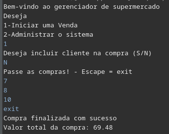
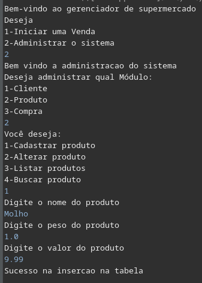
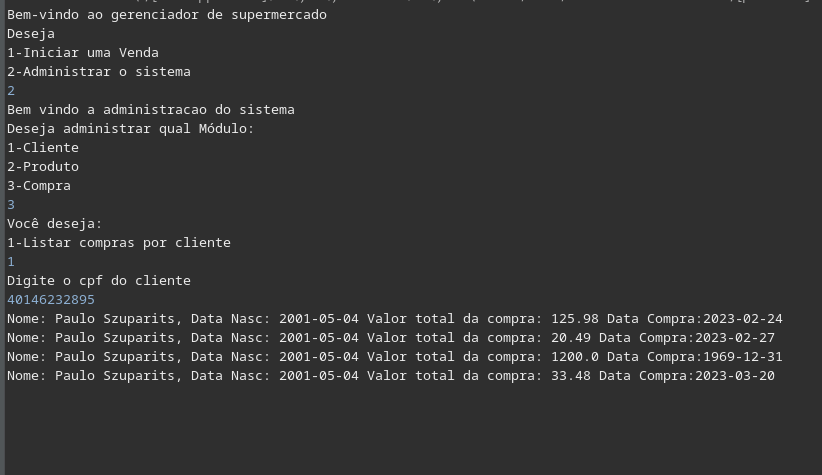

# Gerenciador de Supemercado

## Objetivo
Com o objetivo de ser um gerenciador básico para supermercados, este software feito na **linguagem java** visa gerenciar clientes, produtos e compras usando de um **banco de dados mysql**.

## Funcionalidades

#### Iniciar Venda   

A funcionalidade de iniciar venda é feita para que o usuário consiga vender um ou mais produtos do supermercado em questão. Nessa venda, o usuário pode ou não vincular um cliente.Após escolher se irá ou não vincular a venda a um cliente, o usuário irá digitar cada produto que será vendido pelo estabelecimento.Ao finalizar a venda, será mostrado o valor que foi gasto nessa venda.  

  

#### Administrar o sistema  

A funcionalidade de administrar o sistema serve para o usuário ter um acesso ao banco de dados de maneira mais profunda. Esta funcionalidade está dividida em módulos, sendo eles:  
**Módulo Cliente**  
**Módulo Produto** 
**Módulo Compra**  
Cada um destes módulos possui funcionalidades.  
Os módulos **cliente e produto** possuem as funcionalidades de:  
Cadastrar, alterar, listar e buscar.  

  

Já o módulo de **compras** possui a funcionalidade de listar todas as compras feitas por um cliente em específico.  

## Documentação técnica  

### Classes  

#### Conexao

A classe conexao possui 6 parametros, sendo eles:  

- String server;
- String database;
- String port;               
- String user;
- String passwd;
	
- Connection conection;

A classe não possui construtor. Ao instancia-la, a classe entra em um "try catch" onde os parametros são inicializados com os dados do banco e a variavel conection é atribuida por uma função getConnection da classe DriveManager.  

##### Métodos  

A classe conexão possui 1 método:
-getConection -> Retorna this.conection;  
    
  

#### Cliente  

A classe cliente possui 7 parâmetros, sendo eles:
-	int idCliente;
-	String nome;
-	String sobrenome;
-	Date dtNasc;
-	String cpf;
-	Endereco endereco;
-	Compra compra;

E possui 3 construtores, 1 deles recebe nome, sobrenome, dtNasc, cpf, endereço, o outro construtor recebe nome, sobrenome, drNasc e compra e o ulitmo construtor recebe idCliente, nome, sobrenome, dtNasc, cpf, endereco.  

##### Métodos

Todos os parametros possuem métodos "get e set".  

O cliente possue 3 métodos:  
- InsereCLiente -> recebe a declaração de conexão ,insere o cliente no banco de dados e retorna um objeto Retorno
- retornaClienteMaisCompra -> retorna uma string que contém nome, sobrenome, dtNasc, e compra
- toString -> retorna uma string contendo os dados do cliente.  

  

#### Endereço  

A classe endereço possui 3 parametros, sendo eles:
- String cep;
- int numero;
- String complemento;  

E possui 1 construtor que recebe cep, numero e complemento.  

##### Métodos  

Todos os parametros possuem métodos "get e set". 

#### Produto

A classe produto possui 4 parametros, sendo eles:
-	int idProduto;
-	String nome;
-	double peso;
-	double valor;  

E possui 2 construtores, 1 deles recebe nome, peso e valor. O outro recebe IdProduto, nome, peso e valor.  

  

##### Métodos  

Todos os parametros possuem métodos "get e set". 

O produto possui 2 métodos:
- InsereProduto -> recebe a declaração de conexão, insere o cliente no banco de dados e retorna um objeto Retorno
- toString -> retorna uma string contendo os dados do produto.  

  

#### Compra  

A classe compra possui 3 parametros, sendo eles:
- int idCliente;
- double somaCompraCliente;
- Date dtCompra;  

E possui um construtor que recebe, idCliente, somaCompraCliente, dtCompra  

##### Métodos  

Todos os parametros possuem métodos "get e set". 

A compra possui 2 métodos:
- InsereCompra -> recebe a declaração de conexão, insere a compra no banco de dados e retorna um objeto Retorno.
- toString -> retorna uma string contendo os dados da compra  

  

#### Retorno

A classe retorno possui 5 parâmetros, sendo eles:  
- String descricaoRetorno;
- Produto produto;
- Cliente cliente;
- ResultSet resultadoQuery;
- double valorProduto;

E possui 5 construtores, o primeiro recebe descricaoRetorno, o segundo recebe cliente e descricaoRetorno, o terceito recebe resultadoQuery e descricaoRetorno e o ultimo recebe valorProduto e descricaoRetorno.  

##### Métodos  

Todos os parametros possuem métodos "get e set".  

#### Retornos  

A classe retorno possui 13 parametros estáticos, sendo eles:
- Retorno erroDeInsercao = new Retorno("Erro de inserção na tabela");
- Retorno sucessoNaInsercao = new Retorno("Sucesso na insercao na tabela");
- Retorno erroNaAlteracao = new Retorno("Erro na alteracao do item na tabela");
- Retorno sucessoNaAlteracao = new Retorno("Sucesso na alteracao do item na tabela");
- Retorno erroNaBusca = new Retorno("Erro na procura do item");
- Retorno itemNaoEncontradoBusca = new Retorno("Erro na busca pelo item, item nao encontrado");
- Retorno sucessoNaBusca = new Retorno("Sucesso na busca, Item encontrado");
- Retorno erroNaDelecao = new Retorno("Erro na delecao do item");
- Retorno sucessoNaDelecao = new Retorno("Sucesso na delecao do item");
- Retorno erroNaListagem = new Retorno("Erro na listagem dos itens");
- Retorno sucessoNaListagem = new Retorno("Sucesso na listagem dos itens");
- Retorno compraFinalizadaSucesso = new Retorno("Compra finalizada com sucesso");
- Retorno compraNaoFinalizadaErro = new Retorno("Compra nao finalizada, ERRO!");  

E a classe retornos não possui construtores.  

 

##### Métodos  
Todos os parametros possuem métodos "get e set". 

A classe Retornos possui 5 métodos:  
- retornaRetornoMaisProduto -> recebe um Retorno e um Produto e retorna um Retorno contendo os dois parametros recebidos.
- retornaRetornoMaisCliente -> recebe um Retorno e um Cliente e retorna um Retorno contendo os dois parametros recebidos.
- retornaRetornoMaisResultSet -> recebe um Retorno e um ResultSet e retorna um Retorno contendo os dois parametros recebidos.
- retornaRetornoMaisValorProduto -> recebe um Retorno e um double e retorna um Retorno contendo os dois parametros recebidos.
- retornaRetornoMaisValorCompra -> recebe um retorno e um double e retorna um Retorno contendo os dois parametros recebidos.  

  

#### CamposAlteracao  

A classe possui 5 parametros, sendo eles:
- String nomeClausulaWhere;
- String tabela;
- int id;
- String campo;
- String valorParaAlterarCampo;  

E a classe CamposAlteracao possui 3 construtores, o primeiro recebe nomeClausulaWhere, tabela, id e campo, o segundo recebe tabela, id, campo e valorParaAlterarCampo e o ultimo recebe tabela, campo e id.  

##### Métodos  

Todos os parametros possuem métodos "get e set". 

### Classes auxiliares  

São 4 classes auxiliares ao todo, das quais possuem apenas funções:  
- FuncoesModuloCliente
- FuncoesModuloProduto
- FuncoesModuloCompra
- FuncoesParaClasses  

#### FuncoesParaClasses

A classe possui 7 métodos, sendo eles:
- isEmptyList -> recebe uma lista e retorna um boolean
- buscaCliente -> recebe uma declaracao de conexão e uma string e retorna um retorno do tipo cliente mais retorno
- buscaValorProduto -> recebe uma declaracao de conexão e uma String id e retorna um retorno do tipo double mais retorno
- buscaProduto -> recebe uma declaração de conexao e uma string e retorna um retorno do tipo produto mais retorno  
- listaItensTabela -> recebe uma declaracao de conexao e uma string e retorna um retorno do tipo ResultSet mais retorno  
- removeItem tabela -> recebe uma declaracao de conexao e um CamposAlteracao e retorna um retorno  
- alteraItemTabela -> recebe uma declaracao de conexao e um CamposAlteracao e retorna um retorno  

  

  

  

  

  

#### FuncoesModuloCliente  

A classe possui 4 métodos, sendo eles:

- cadastrarCliente -> recebe uma declaracao de conexao, e chama a funcao insereCliente da classe cliente
- alterarCliente -> recebe uma declaracao de conexao, e chama a funcao alteraItemTabela das FuncoesParaClasses
- listaClientes -> recebe uma declaracao de conexao, chama a funcao listaItensTabela das FuncoesParaClasses e retorna um ArrayList
- buscaCliente -> recebe uma declaracao de conexao, e chama a funcao buscaCliente das FuncoesParaClasses  

  

  

  

  

#### FuncoesModuloProduto 

A classe possui 4 métodos, sendo eles:

- cadastrarProduto -> recebe uma declaracao de conexao, e chama a funcao insereProduto da classe cliente
- alterarProduto -> recebe uma declaracao de conexao, e chama a funcao alteraItemTabela das FuncoesParaClasses
- listaProduto -> recebe uma declaracao de conexao, chama a funcao listaItensTabela das FuncoesParaClasses e retorna um ArrayList
- buscaProduto -> recebe uma declaracao de conexao, e chama a funcao buscaProduto das FuncoesParaClasses  

  

  

  

  

#### FuncoesModuloCompra  

A classe possui apenas 1 método, sendo ele:

- listaComprasCliente -> recebe uma declaração de conexão e retorna um ArrayList  

  

